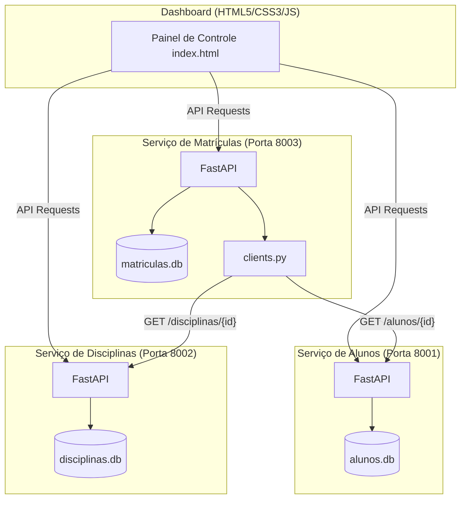

# Sistema Acadêmico Distribuído - UFOPA

Este projeto é um **Sistema Acadêmico Distribuído** composto por três microsserviços desenvolvidos com **FastAPI** e bancos de dados **SQLite** individuais (banco por serviço). Os serviços se comunicam via requisições HTTP REST síncronas com tratamento resiliente de falhas.

O projeto inclui um **Dashboard Frontend moderno e responsivo** (`index.html`) com tema escuro (glassmorphism), visualização da topologia da rede, alertas e simulação de caos integrado.

Projeto final da disciplina de **Sistemas Distribuídos** da Universidade Federal do Oeste do Pará (UFOPA).

---

## 🛠️ Requisitos de Instalação

Para rodar e replicar o projeto na sua máquina ou na de um amigo, você precisará de:

1. **Docker Desktop** (que já inclui o **Docker Compose**).
2. Um **Navegador Web** moderno (Chrome, Edge, Firefox, Safari).
3. **Git** (para clonar o repositório).

---

## 🚀 Como Replicar e Executar (Modo Rápido com Docker)

Esta é a forma recomendada para executar a aplicação, pois configura todo o ambiente automaticamente.

### 1. Clonar o Repositório
Abra o terminal e execute:
```bash
git clone <URL_DO_SEU_REPOSITORIO>
cd Mark2
```

### 2. Subir os Contêineres
Inicie todos os microsserviços rodando o comando na raiz do projeto:
```bash
docker-compose up --build
```
*Isso irá construir as imagens Docker, configurar a rede local e criar as pastas de dados contendo os bancos SQLite limpos para cada microsserviço.*

Os serviços estarão disponíveis nas seguintes portas locais:
- **Alunos Service:** `http://localhost:8001`
- **Disciplinas Service:** `http://localhost:8002`
- **Matrículas Service:** `http://localhost:8003`

### 3. Acessar o Dashboard Frontend
Basta abrir o arquivo **`index.html`** na raiz do projeto diretamente no seu navegador. 
- Você pode dar dois cliques no arquivo no gerenciador de arquivos ou arrastá-lo para dentro do navegador.
- O painel irá se conectar automaticamente aos microsserviços locais.

---

## 🌐 Arquitetura do Sistema



### Principais Decisões e Recursos de Design:
- **Banco de Dados por Serviço:** Cada microsserviço gerencia exclusivamente seu próprio banco SQLite localizado sob a pasta `/app/data/`.
- **Soft Delete e Reativação:** A exclusão de alunos ou disciplinas é lógica (`ativo=False`). Desenvolvemos endpoints `/reativar` (`PATCH`) que permitem a recuperação/reativação desses registros diretamente pelo Dashboard.
- **Resiliência e Tolerância a Falhas:** O serviço de Matrículas valida a existência do aluno e da disciplina consultando os respectivos serviços de forma síncrona. Se um deles estiver inativo, o sistema trata a falha graciosamente (retornando `503 Service Unavailable` em vez de travar).
- **Prevenção de Race Conditions:** Restrição única composta no SQLite no microsserviço de Matrículas para evitar que requisições concorrentes dupliquem a matrícula ativa do mesmo aluno na mesma disciplina.
- **Painel de Simulação de Caos:** O Dashboard possui um controle para simular falhas, permitindo desativar e reativar instâncias no Docker para testar a resiliência em tempo real.

---

## 🧪 Como Testar Manualmente

Você pode interagir e realizar testes usando:
1. **Documentação Swagger Interativa:**
   - Documentação de Alunos: `http://localhost:8001/docs`
   - Documentação de Disciplinas: `http://localhost:8002/docs`
   - Documentação de Matrículas: `http://localhost:8003/docs`
2. **Dashboard Visual (`index.html`):**
   - Acesse as abas para cadastrar, listar, desativar e reativar Alunos ou Disciplinas.
   - Realize matrículas e observe a atualização em tempo real das tabelas.
   - Utilize a aba **Simulação de Caos** para derrubar e subir serviços, observando as mudanças no status da topologia de rede.
